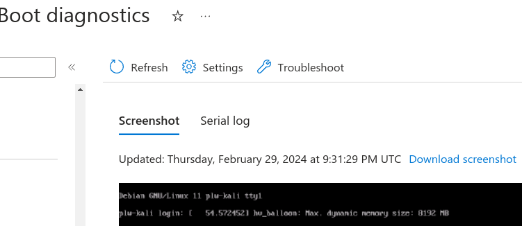
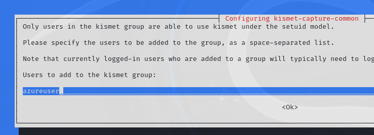

# Create Kali box from Debian Azure Image

## Create VM
First [create](./AZURECLI.md#create-vm-resources) a VM instance with image parameters:


```
--name plw-kali \
--image Debian11 \
--size Standard_DS1_v2 \
--admin-username kali 
```

Other sizes
```
az vm list-sizes  --location westus3 | grep D2
...
4                   4096          Standard_D2lds_v5          2                1047552           76800
4                   8192          Standard_D2a_v4            2                1047552           51200
4                   8192          Standard_D2as_v4           2                1047552           16384
```

Consider sizing [Costs](./COSTS.md)

## Enable Boot Diagnostics

```
 az vm boot-diagnostics enable --resource-group PLW-AZURE --name plw-kali
 ```

In Azure portal under "Help" you can enable boot diagnostics. This will help troubleshoot why an image is not rebooting.


You'll need to enable a managed storage account.


This will capture serial logs


and screenshots of the boot screen.



## Login to host
```
az ssh vm --resource-group PLW-AZURE --name plw-kali --local-user kali --private-key-file <path>
```


## Download Kali Keys
wget and screen are already installed with Azure Debian11 image. 

Download Kali package distribution key.

```
wget https://archive.kali.org/archive-key.asc
sudo cp archive-key.asc /etc/apt/trusted.gpg.d/
```

## Update Kali Packages

As root, update package list

```
sudo su -
echo "deb http://http.kali.org/kali kali-rolling main contrib non-free" >> /etc/apt/sources.list
apt-get  update -y 
```


## Prepare to Install Unattended

### Install debconf-utils
debconf-utils provides the `debconf-get-selections` cli

``` 
sudo apt install debconf-utils -y
```

### Prepare Unattended Config for python3-venv

Chrony and ssh launch dialogs prompt to keep current configuration. 


A libc6 dialog prompts for restart of services. 


Adjust Debconf settings and use configuration parameters to avoid interactive restart and confirmation dialogs.  

```
echo 'libc6 libraries/restart-without-asking boolean true' | sudo debconf-set-selections
```

### Prepare Unattended Config for kali-linux-default

Kali installation launches a number of dialogs that we should select options for to not be disrupted during an unattended installation.


```
echo 'keyboard-configuration  keyboard-configuration/variant  select  English (US)' >> selections.conf 
```


```
echo 'console-setup   console-setup/codeset47 select  Guess optimal character set' >> selections.conf
```


```
echo 'macchanger      macchanger/automatically_run    boolean true' >> selections.conf
```


```
echo 'kismet-capture-common   kismet-capture-common/install-setuid    boolean true' >> selections.conf
```




```
echo 'kismet-capture-common   kismet-capture-common/install-users     string  azureuser' >> selections.conf
```


```
echo 'wireshark-common        wireshark-common/install-setuid boolean true' >> selections.conf
```


echo 'sslh    sslh/inetd_or_standalone        select  standalone' >> selections.conf

```
sudo debconf-set-selections < selections.conf
```


## Install Python Virtual Environment for Development

I like to use python virtual-env (Force old SSH config to stay):
```
DEBIAN_FRONTEND="noninteractive" apt-get install -o Dpkg::Options::="--force-confold" python3-venv -y 
```

## Install Kali
Now install Kali as root
```
DEBIAN_FRONTEND="noninteractive" apt-get install kali-linux-default -y 
```

This took about 33 minutes on a Standard_D2a_v4 instance.

### Reboot

```reboot ```

### Test msfconsole

``` 
msfconsole 
```


## Install VNC Remote Access

```
sudo apt update && sudo apt install -y kali-desktop-xfce

sudo update-alternatives --config x-session-manager

vncserver -geometry 4096x2160 -geometry 1920x1080 -geometry 1280x1024
```

Set a strong password, but don't expose it to the Internet. You'll use an SSH tunnel to get there:

```
ssh -i ~/.ssh/id_rsa kali@<remoteip> -L 5901:localhost:5901
```

My Kali host local to my home has xtightvnc installed already

```
sudo apt install xtightvncviewer
xtightvncviewer
```

A tiny window will pop open and you can connect to localhost:590x (where x is the vnc terminal e.g. :1, :2)


Now you have a Remote GUI to a high-speed connection on a VM instance with performance you can tweak, just by resizing it!


## Cleanup

Remember to detatch / Delete instances so you won't get billed excessively 

```
az vm delete --resource-group PLW-AZURE --name plw-kali
az network public-ip delete --name plw-kaliPublicIP --resource-group PLW-AZURE 
```

# Notes

An Error occurs if you try to install kali-linux-everything: 
```firmware-misc-nonfree but it is not installable```

```apt-get upgrade```


The image stalls out if you reboot. 

I followed a recommendation to change grub settings.


```
sudo gedit /etc/default/grub
GRUB_TIMEOUT=0
sudo update-grub 
```

Determine Serial port (This was already fine)

```
ps aux | grep ttyS0

/sbin/agetty -o -p -- \u --keep-baud 115200,57600,38400,9600 ttyS0 vt220
```

```
GRUB_DEFAULT=0
GRUB_TIMEOUT=0
GRUB_DISTRIBUTOR=`lsb_release -i -s 2> /dev/null || echo Debian`
GRUB_CMDLINE_LINUX_DEFAULT="quiet splash acpi=off"
GRUB_CMDLINE_LINUX="console=tty0 console=ttyS0,115200 earlyprintk=ttyS0,115200 consoleblank=0"
GRUB_TERMINAL="console serial"
GRUB_SERIAL_COMMAND="serial --speed=115200"
```

```
apt-get install grub-emu
```

```
GRUB_TERMINAL_OUTPUT="gfxterm serial"
sudo update-grub 
```


Ultimately it isn't booting because the boot image isn't signed. #TODO

