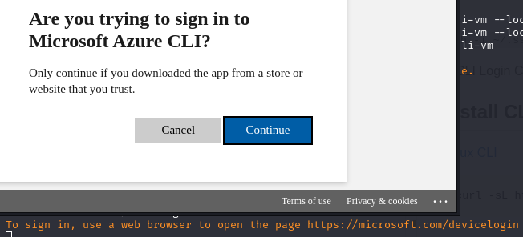

# Azure training 2024

You've lost your job! What are you going to do next!?

I am not going to Disneyland, unfortunately. The community support has been overwhelmingly positive. I have already had a number of colleagues reach out to me confident that my experience will land me a job fast. 

On the other hand, I also just applied to a remote position for which I'm super-qualified but I don't have Azure experience, or really any Microsoft Cloud experience beyond around 2012. 

So today I launched a free Azure account to kick the tires. This is my effort to pay it forward to the community or otherwise showcase my competency to a prospective employer.

[Create Github Account](#create-github-account)

[Create Azure Account](#creating-azure-account)

[Creating Resources](#creating-resources)


## Create Github Account

Microsoft will prompt you to select a login for Azure portal. If you don't have a Microsoft account you'll be prompted to create one.  You may want to create a Github account if you don't have one.

https://github.com/signup


## Creating Azure Account

### Login
Navigate to https://portal.azure.com to login.


### Create Profile
You'll be prompted to provide profile information for your Azure account.


### Credit Card Verification
You need to provide a credit card for account verification. You have not chosen to be billed and can still take advantage of a free account trial period.


### Getting Started Checklist

Azure will present you with training modules to get started.


## Creating Resources

You can create resources using the portal or cli. 

You will need to create a resource group first

```az group create --name PLW-AZURE2 --location westus3```

You can do this also in the portal.


When creating a VM you first need to create the ssh-key which is used to access the host as azureuser.

### Create SSH Key
ssh-keygen -t rsa -b 4096 -C "Comment"

### Create a VM with the Portal

The home page will present options to create resources.


You can select an option top create a resource such as a Virtual Machine.


Select your free Azure Subscription, Region, Availability Zone, instance size and OS Image. 

I selected Ubuntu on x64 in a physically separated region within the US West region, where I am. I started with a standard D2s size, which is about 70 dollars / month if I keep it running, but I've since switched this to a DS1_v2 with 1vCPU and 3.5 GB of RAM. 


#### Spot discount

B1ls with 1 vcpu and only a half gig of memory is 4 dollars / month.


However, this size does not support [Spot Discount](https://learn.microsoft.com/en-us/azure/virtual-machines/spot-vms) which saves cost by allowing Microsoft to evict your host when costs or capacity limits are exceeded.

Click "See all sizes" and enable a filter for monthly cost to compare price. 


\

In any case I entered a maximum price of 5 dollars. I read of [Troy Hunt's](https://www.troyhunt.com/how-i-got-pwned-by-my-cloud-costs/) recent nightmares with cost control for Cloud Flare and I'd rather not add a huge cloud bill to my unemployment situation. 


### Create a VM with the CLI

The alternative is to build these with the CLI. First you need to install it. It does not install happily on Kali linux, so I built a container image for this.

[Azure CLI container image](./tools/Dockerfile)

``` docker build -f tools/Dockerfile ./tools -t azure-cli ```

``` docker run --rm -it azure-cli ```

docker$ ``` az configure ```   
docker$ ``` az login ```   
docker$ ```az vm list-sizes westus3 ```

Let's create the VM as Debian so I can convert it into a Kali Server

docker$ 
``` 
az vm  create --location westus3 \
                         --name plw-cli-vm \
                         --resource-group PLW-AZURE \
                         --image Debian11 --size Standard_B1ls \
                         --ssh-key-values /root/id_rsa.pub 
```

```ssh -i ~/.ssh/id_rsa azureuser@20.163.83.243```




## Install CLI console
[Linux CLI](https://learn.microsoft.com/en-us/cli/azure/install-azure-cli-linux?pivots=apt)

```
curl -sL https://aka.ms/InstallAzureCLIDeb | sudo bash
```

### Using Azure CLI

Here are some quick and handy azure cli commands. For more detail see the [Azure CLI Readme](./AZURECLI.md)

```
az vm show --resource-group PLW-AZURE --name plw-vm --show-details

```

```
az vm stop --resource-group PLW-AZURE --name plw-vm
```

```
az vm deallocate --resource-group PLW-AZURE --name plw-vm
```


```
az ssh vm --resource-group PLW-AZURE --name plw-vm
```
